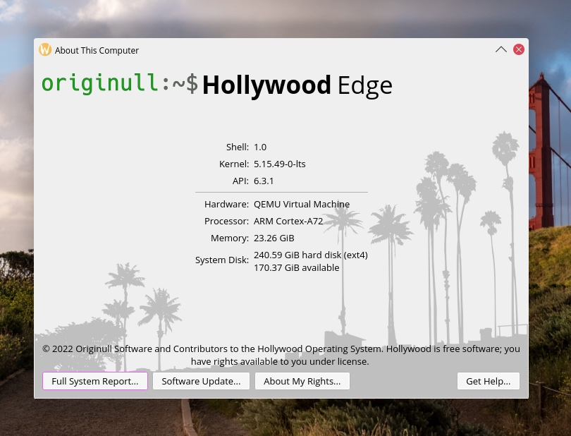
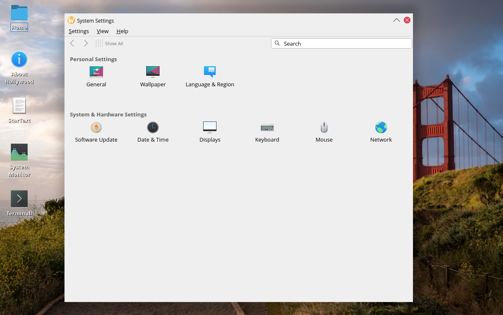
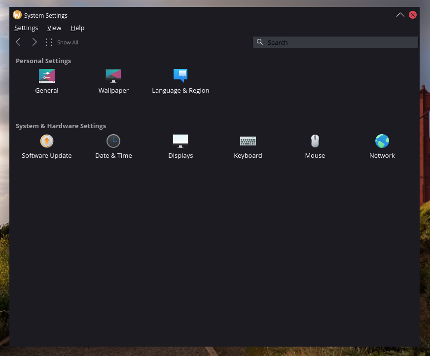
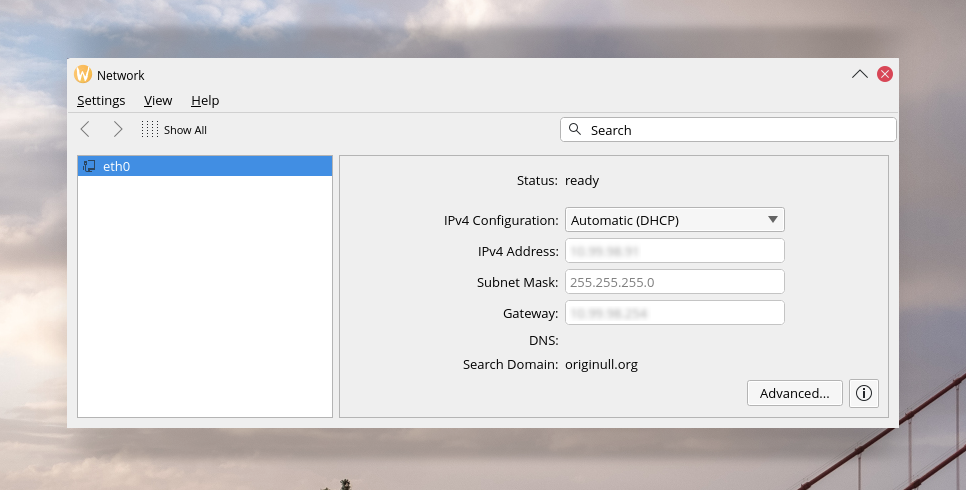
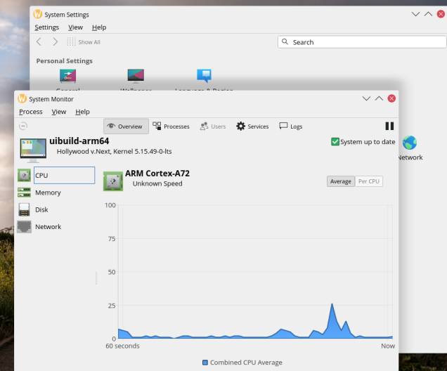
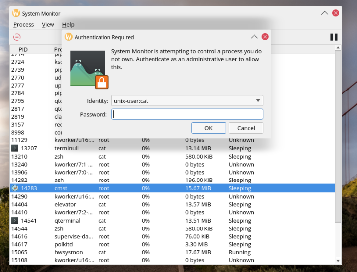
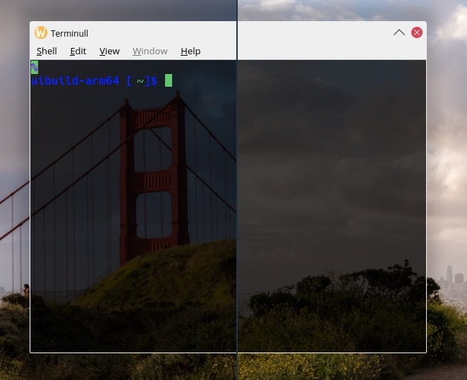

# Hollywood Operating System
This is the **Hollywood** operating system a custom Wayland based freedesktop environment on a lightweight Linux distribution.

## What is this?
Hollywood is a custom freedekstop compliant desktop environment.  It is a work in progress based upon Qt6, Wayland & PipeWire to provide a world-class butter-smooth traditional desktop environment.  The design of the Hollywood desktop is based around well thought out core applications.  It is otherwise a minimal environment providing only what is *required* of an operating system.  Accessories and value-add software is outside of the scope of this project.

Hollywood is also a set of minimal packages to produce a Linux distribution.  Hollywood uses the *apk* package manager from Alpine Linux as well as a subset of Alpine's aports tree retargeted towards glibc.  Hollywood provides glibc, OpenRC init, ext4 and btrfs filesystems, core utilities, Qt5 & Qt6, GTK3 & GTK4 (coming soon), as well as most popular languages.

The Hollywood desktop is designed specifically for the Hollywood packages and vice versa.  The end result goal is an easy to use, low maintenance fully integrated Linux system ready to run your favorite applications.

## Screenshots

**Hollywood is not yet ready for regular usage!** It has bugs and still requires more work.  Here's some screenshots of current progress:

*About Hollywood, showing system specifications.*

*Hollywood Desktop, featuring System Settings.*

*System Settings featured in dark mode.*

*The network applet in System Settings.*
 

*System Monitor utility.*

*System monitor utility controlling foreign owned process via polkit authentication agent.*

*Beginning of multiple-screen support with spanning Terminull window.*